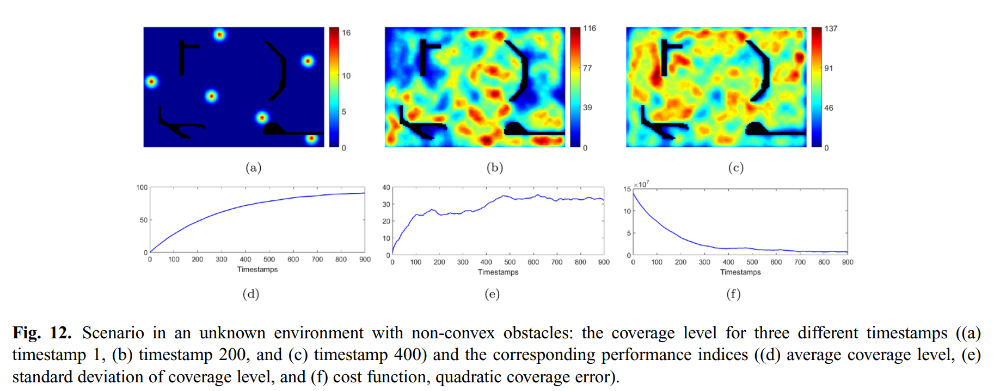

# A Distributed, Plug-n-Play Algorithm for Multi-Robot Applications With a Priori Non-Computable Objective Functions (Python Version)

> **Kapoutsis, A.C., Chatzichristofis, S.A. and Kosmatopoulos, E.B., 2019.**  
> *A distributed, plug-n-play algorithm for multi-robot applications with a priori non-computable objective functions.*  
> The International Journal of Robotics Research, 38(7), pp.813-832.  
> [**Journal Link**](https://journals.sagepub.com/doi/10.1177/0278364919845054) | [**arXiv**](https://arxiv.org/abs/2111.07441)

This Python-based project presents a distributed algorithm applicable to many practical multi-robot applications. In such multi-robot applications, the user-defined objectives of the mission can be cast as a general optimization problem, without explicit guidelines for the subtasks per different robot.

---

## Twin Repository (Java)
A **Java** Twin implementation is also available here: [A-distributed-plug-n-play-algorithm-for-multi-robot-applications](https://github.com/athakapo/A-distributed-plug-n-play-algorithm-for-multi-robot-applications). 

---
This project implements a **distributed optimization** algorithm applicable to a wide range of **multi-robot** applications. The user-defined mission objectives are cast as a general optimization problem, without an explicit breakdown of subtasks per robot. Despite each robot not having direct access to the other robots’ decision variables or measurements, it effectively updates its own decision variables to cooperatively achieve the team objectives.

**Key Features**  
- **Plug-n-play**: Each robot can join or leave without fundamental changes to the algorithm.  
- **Data-driven gradient descent**: Robots adjust their decisions based on local cost function feedback.  
- **Proven Convergence**: The algorithm behaves similarly to Block Coordinate Descent (BCD) methods, even though global system dynamics are unknown.

<p align="center">
  
</p>

---

## Table of Contents

1. [Included Testbeds](#included-testbeds)  
2. [Repository Structure](#repository-structure)  
3. [Installation](#installation)  
4. [Usage](#usage)
5. [Applications](#applications)
6. [Adding a New Multi-Robot Testbed](#adding-a-new-multi-robot-testbed)  
7. [Testing and Validation](#testing-and-validation)  
8. [License](#license)  
9. [Citation](#citation)

---

## Included Testbeds

This Python repository ships with four frameworks:

1. **HoldTheLine**  
   A simple (toy) problem where robots must be positioned in a specific line formation.

   `The agents do not explictly know  about the formation; they learn this by the online cost function feedback`

2. **AdaptiveCoverage2D**  
   An application where robots must spread out over a 2D environment, aggregating in areas of high sensory interest.

   `The agents do not explictly know the environment’s important regions; they learn these online from local sensors.`

3. **IntentAware**  
   A dynamic, collaborative task where robots adaptively position themselves in an evolving 2D environment. 

   `The agents do not have explicit individual goals; they learn online to optimize a global cost that integrates coverage, team cohesion, and target tracking.`

4. **HazardEnclosure**  
   A dynamic, collaborative task where robots must collectively form a barrier around an evolving hazardous region.

   `The agents do not receive explicit individual instructions; instead, they learn online to adjust their positions cooperatively to minimize gaps, maintain a uniform enclosure, and track the moving hazard.`

---

## Repository Structure
```text
pyBCD-CAO/
├── main.py                # The main script to run the optimization process.
├── cao.py                 # Implementation of the core CAO algorithm.
├── centralized_decision_making.py  # Module for centralized decision-making strategies (if needed).
├── agent_information.py  # Defines the structure for storing and managing agent information.
├── resource_loader.py    # Utility for loading resources like parameter files.
├── test_validator.py      # Contains unit tests to validate the functionality of each testbed.
├── optimization_loop.py   # Implements the main optimization loop for the algorithm.
├── testbeds/              # Directory containing various testbed scenarios.
│   ├── HoldTheLine/       # A simple testbed where robots align in a line formation.
│   │   ├── Framework.py    # Defines the specific framework and logic for this testbed.
│   │   └── Parameters.properties  # Configuration parameters for this testbed.
│   ├── AdaptiveCoverage2D/  # A testbed where robots cover a 2D space with adaptive density.
│   │   ├── Framework.py    # Defines the specific framework and logic for this testbed.
│   │   └── Parameters.properties  # Configuration parameters for this testbed.
│   └── ...                # Other potential testbeds.
├── images/               # Directory for storing images used in the applications of the algorithm.
├── testbed_setup.py      # An abstract base class providing a template for creating new testbed frameworks.
├── requirements.txt       # Lists the project's dependencies for easy installation.
├── setup.py               # Standard Python setup script for packaging and distribution.
└── README.md              # This readme file providing an overview of the project.
```

## Installation

1) Clone the repository:
```bash
git clone https://github.com/yourusername/pyBCD-CAO.git
cd pyBCD-CAO
```
2) (Optional) Create a virtual environment:
```bash
python -m venv .venv
source .venv/bin/activate  # On Windows: .venv\Scripts\activate
```
3) Install depedencies:
```bash
pip install -r requirements.txt
```
or
```bash
pip install .
```
## Usage
To run one of the included testbeds (e.g., `HoldTheLine`):
```bash
python main.py HoldTheLine
```
The script will:
1) Load the relevant `Parameters.properties` from the testbed directory.
2) Construct the initial conditions (possibly random or from a specified arrangement).
3) Iterate the optimization loop, printing or storing the cost function values.

## Applications

This repository showcases a variety of applications demonstrating advanced multi-robot coordination and distributed intelligence, tackling real-world challenges with innovative solutions.

### 1. Distributed and Multi-Agent Reinforcement Learning for EV Charging Scheduling

**Objective:** Optimize electric vehicle (EV) charging schedules to reduce energy costs, improve charging station efficiency, and enhance user satisfaction.

**Key Features:**

* Distributed and multi-agent reinforcement learning framework.
* Autonomous decision-making at each charging spot.
* Improved scalability and efficiency.
* Protection of private information.

**Visual:**


**Reference:**

* Korkas, C.D., Tsaknakis, C.D., Kapoutsis, A.C. and Kosmatopoulos, E., 2024. Distributed and Multi-Agent Reinforcement Learning Framework for Optimal Electric Vehicle Charging Scheduling. *Energies (19961073)*, (15). [[DOI: 10.3390/en17153694](https://www.mdpi.com/1996-1073/17/15/3694)]


### 2. Building Synergetic Consensus for Dynamic Gas-Plume Tracking

**Objective:** Deploy a swarm of UAVs with gas sensors to track and maximize perception of dynamically evolving gas plumes, focusing on high-concentration areas.

**Key Features:**

* Dynamic gas-plume tracking.
* Swarm formation adjustment for optimal perception.
* Focus on high-concentration areas.

**Visual:**


**Reference:**

* Kapoutsis, A.C., Michailidis, I.T., Boutalis, Y. and Kosmatopoulos, E.B., 2021. Building synergetic consensus for dynamic gas-plume tracking applications using UAV platforms. *Computers & Electrical Engineering*, 91, p.107029. [[DOI: 10.1016/j.compeleceng.2021.107029](https://doi.org/10.1016/j.compeleceng.2021.107029)]

**Extension:**

* Michailidis, I.T., Kapoutsis, A.C., Kosmatopoulos, E.B. and Boutalis, Y., 2021, June. Dynamic Plume Tracking Utilizing Symbiotic Heterogeneous Remote Sensing Platforms. In *IFIP International Conference on Artificial Intelligence Applications and Innovations* (pp. 607-618). Springer, Cham. [[DOI: 10.1007/978-3-030-79150-6_48](https://doi.org/10.1007/978-3-030-79150-6_48)]


### 3. Autonomous and Cooperative Design of Monitor Positions for UAVs

**Objective:** Position a swarm of UAVs in an unknown terrain to maximize situational awareness by detecting and identifying unique objects of interest.

**Key Features:**

* Maximization of situational awareness.
* Object detection and identification using YOLOv3.
* Duplicate object identification.
* Cooperative UAV positioning.

**Visual:**


**Reference:**

* Koutras, D.I., Kapoutsis, A.C. and Kosmatopoulos, E.B., 2020. Autonomous and cooperative design of the monitor positions for a team of UAVs to maximize the quantity and quality of detected objects. *IEEE Robotics and Automation Letters*, 5(3), pp.4986-4993. [[DOI: 10.1109/LRA.2020.3004780](https://doi.org/10.1109/LRA.2020.3004780)]


### 4. Adaptive Coverage Control Utilizing Voronoi Partitioning

**Objective:** Deploy a network of robots to spread out over an environment, concentrating in areas of high sensory interest. The robots learn these areas online from sensor measurements, without prior knowledge.

**Applications:**

* Environmental monitoring and clean-up
* Automatic surveillance of buildings/towns
* Search-and-rescue missions

**Key Features:**

* Distributed algorithm for plug-n-play operation.
* Online learning of sensory interest areas.
* Voronoi partitioning for efficient coverage.

**Visual:**


**Reference:**

* Kapoutsis, A.C., Chatzichristofis, S.A. and Kosmatopoulos, E.B., 2019. A distributed, plug-n-play algorithm for multi-robot applications with a priori non-computable objective functions. *The International Journal of Robotics Research*, 38(7), pp.813-832. [[DOI: 10.1177/0278364919845054](https://doi.org/10.1177/0278364919845054)]


### 5. Three-Dimensional Surveillance of Unknown Areas

**Objective:** Deploy a team of flying robots for surveillance over complex, unknown terrain, maximizing terrain visibility while minimizing distance to team members.

**Key Features:**

* Surveillance coverage of complex, non-convex terrains.
* Optimization of visibility and proximity.
* Fault-tolerant characteristics.
* Adaptation to changes in mission objectives during execution.

**Visual:**


**Reference:**

* Kapoutsis, A.C., Chatzichristofis, S.A. and Kosmatopoulos, E.B., 2019. A distributed, plug-n-play algorithm for multi-robot applications with a priori non-computable objective functions. *The International Journal of Robotics Research*, 38(7), pp.813-832. [[DOI: 10.1177/0278364919845054](https://doi.org/10.1177/0278364919845054)]


### 6. Persistent Coverage Inside Unknown Environments

**Objective:** Maintain continuous coverage of an area of interest using robots with limited sensor range, where coverage level decays over time.

**Key Features:**

* Persistent coverage with time-decaying coverage levels.
* Operation in unknown environments.
* Utilization of robots with limited sensor ranges.

**Visual:**



**Reference:**

* Kapoutsis, A.C., Chatzichristofis, S.A. and Kosmatopoulos, E.B., 2019. A distributed, plug-n-play algorithm for multi-robot applications with a priori non-computable objective functions. *The International Journal of Robotics Research*, 38(7), pp.813-832. [[DOI: 10.1177/0278364919845054](https://doi.org/10.1177/0278364919845054)]

## Adding a New Multi-Robot Testbed
1) Create a New Directory under `testbeds/`, e.g. `testbeds/MyTestbed`.
2) Implement a `Framework` class inside `MyTestbed/Framework.py`

```python 
from testbeds.testbed_setup import testbed_setup  # or from myproject.abstract_setup import Setup


class MyTestbedFramework(testbed_setup):
   def __init__(self):
      super().__init__()
      # Additional initialization

   def worldConstructor(self):
      # Construct the environment, e.g. self.Q = ...
      pass

   def CalculateCF(self, decision_variables):
      # Implement your cost function computations
      pass

   def EvaluateCF(self, decision_variables, r):
      # Evaluate cost from the perspective of robot r
      pass

   def isThisAValidDecisionCommand(self, r, decision_variables):
      # Return True if the vector is valid for robot r
      pass

   def fetchDecisionVector(self):
      # Possibly set self.initial_decisions here
      pass
```
3) Create a `Parameters.properties` in `testbeds/MyTestbed/Parameters.properties` to specify parameters like number of robots, iteration count, etc.
4) (Optional) Add a test in `test_validator.py` or a new test file to ensure your new testbed runs properly.

## Testing and Validation

A `test_validator.py` script (or a suite of unittest/pytest tests) is included. It runs various experiments against each testbed to verify:

* Consistency of cost function trends,
* Convergence under different numbers of robots,
* Correct usage of framework parameters.

Run tests with:
```bash
python -m unittest test_validator.py
```
or use your preferred testing framework.

## Authors
* **Athanasios Kapoutsis**  - [Personal Site](http://kapoutsis.info/)

## License
This project is licensed under the GNU GPLv3 License. See the [LICENSE.md](LICENSE.md) file for details.

## Citation
```bibtex
@article{kapoutsis2019distributed,
  title={A distributed, plug-n-play algorithm for multi-robot applications with a priori non-computable objective functions},
  author={Kapoutsis, Athanasios Ch and Chatzichristofis, Savvas A and Kosmatopoulos, Elias B},
  journal={The International Journal of Robotics Research},
  year={2019},
  volume={38},
  number={7},
  pages={813--832},
  doi={10.1177/0278364919845054},
  publisher={SAGE}
}
```
